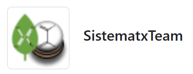
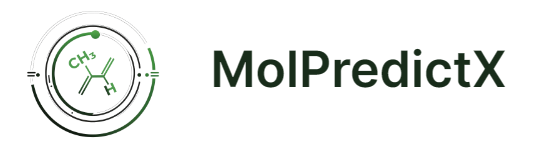
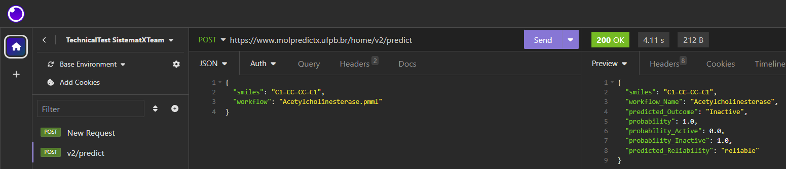

<p align="center">
    
</p>

# 🔨 Teste Técnico (SistematX Team)

</br>

## Projeto: SistematX


SISTEMAT X Web, sigla de "SISTEMAT eXtended Webservices", é um conjunto de ferramentas para gerenciamento de banco de dados de metabólitos secundários que está disponível para consulta de toda a comunidade científica.

- Link: [SistematX](http://sistematx.ufpb.br/)

### :test_tube: Descrição do Desafio (Teste de Lógica)

#### URL do teste de lógica:
[Teste de Lógica (SistematXTeam) - Google Forms](https://forms.gle/x99RzzG4KV7U9os87 "Teste de Lógica (SistematXTeam) - Google Forms")

OBS.: os códigos utilizados nas questões se encontram na pasta /src

</br>

## Projeto: MolPredictX



MolPredictX é uma ferramenta web que permite à comunidade científica obter previsões de atividades biológicas de moléculas. O MolPredictX gerencia modelos preditivos já publicados em artigos científicos indexados e faz previsões de moléculas que o pesquisador deseja investigar.

- Link: [MolPredictX](https://www.molpredictx.ufpb.br/)

### :test_tube: Descrição do Desafio (Lidando com Requisições HTTP)

<p align="center">
    
</p>

1. Utilizando o Python, faça uma requisição POST para a URL https://www.molpredictx.ufpb.br/home/v2/predict, enviando os seguintes dados no formato JSON:
```json
{
	"smiles": "C1=CC=CC=C1",
  	"workflow": "Sars-Cov.pmml"
}
```
#### OBS: alguns outros workflows disponíveis: 
- "Salmonella.pmml", 
- "Acetylcholinesterase.pmml",
- "Dengue larvicida.pmml", 
- "E_coli.pmml"

2. Obtenha os dados da requisição e exiba-os como preferir. 

OBS: Por exemplo, você pode exibir o resultado somente no terminal, ou criar um card e exibi-los em um simples HTML.
